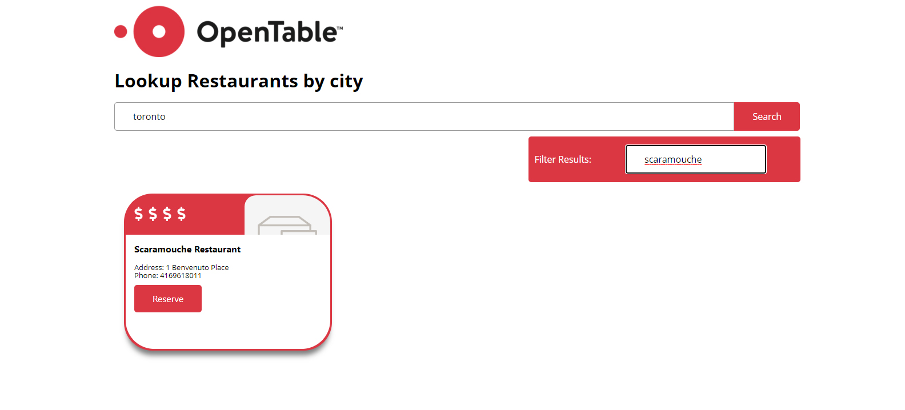

# Open Table React Redux Application

React and Redux application created to find and filter restaurants.

Live Heroku Link to Project:  https://opentable-bmo-redux-example.herokuapp.com/



**Technical questions**

1. **How long did you spend on the coding assignment? What would you add to your**
    **solution if you had more time? If you didn't spend much time on the coding test**
    **then use this as an opportunity to explain what you would add.***

    ```
    A. Unsure, somewhere between 8-10 hours most of it spent on trying to figure out how to mock tests for my asynch thunk call. I do not have a test for that call unfortunately and this is also what I would fix if I had more time.
    ```

2. **What was the most useful feature that was added to the latest version of your
     chosen language?** 

     ```
     A. Destructuring
     // Set itinital array values
     [a, b] = [10, 20];
     // Add to array values
     [a, b, ...rest] = [10, 20, 30, 40, 50];
     ```

3. **How would you track down a performance issue in production? Have you ever**
     **had to do this?**

     ```
     A. I would use the network panel, checking if files aren't loading if there is delays.
     ```

4. **How would you improve the API that you just used?**

       A. I would really like a cuisine type option added.

5. **Please describe yourself using JSON.**

      ```
      A. {
          "Name":"Andy",
          "Occupation":"Developer",
          "Hobbies":[
            "Cooking",
            "Learning",
            "Making Art",
            "Gaming"
          ],
          "Dislikes":[
            "Onions",
            "Comic Sans",
            "Sunburns"
          ]
      }
      
      ```

This project was bootstrapped with [Create React App](https://github.com/facebook/create-react-app).

## Available Scripts

In the project directory, you can run:

### `npm start`

Runs the app in the development mode.<br />
Open [http://localhost:3000](http://localhost:3000) to view it in the browser.

The page will reload if you make edits.<br />
You will also see any lint errors in the console.